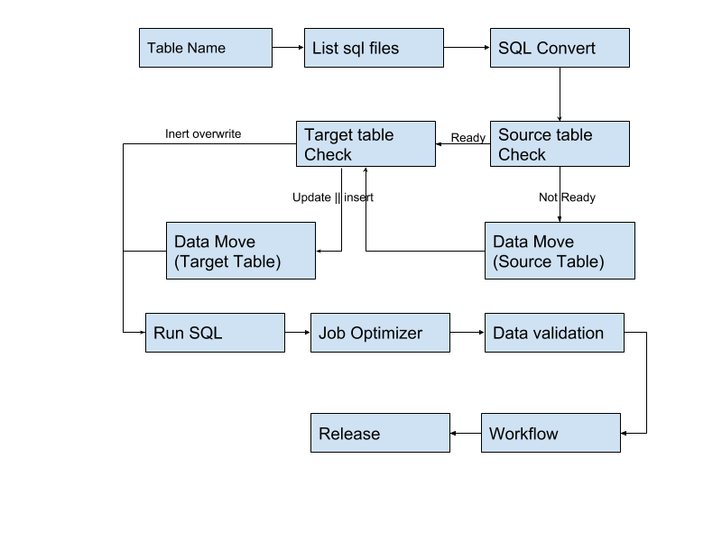

The Zeta Dev Suite provides Spark developers at eBay DSS with an unified, interactive intergrated development environment. So far, it incorporates serivces and tools including
- SQL Converter
- Source Table Check
- Data Move
- Spark SQL runner
- Data Validation

We are working to integrate more functionalites to cover your full developement pipeline, as is showed in the following figure.



This document describes the design and implementation of frontend of Spark SQL Runner, which we called the **Notebook** 
module of Zeta Dev Suite. 

## Set up

**For Dev**

Run `npm run serve` under `/zds-web` to set up hot-load client. The broswer will open automatically. 

To enable SSO, **MUST** access the webpage via `*.corp.ebay.com`. To do so, change host for `localhost.corp.ebay.com` to `127.0.0.1`, then manually access the page via `localhost.corp.ebay.com`. The hot-loading still works properly this way. 

**For production**

Run `npm run build` under `/zds-web`. The generated static files will be placed in `/dist`.

## Configuration 

**Note:** Following documentation describes only design and implmentation of Notebook and Repository. 

## Notebook components hierarchy 

```
- <NotebookTabs>
|--- <Notebook> @keep-alive
|    |--- <VPisces>
|         |--- <EditorWrapper>
|              |--- <Connection>     |
|              |--- <FindSQL>        | 
|              |--- <Params>         |--- Actions
|              |--- <TableCheck>     |
|              |--- <Optimization>   |
|              |--- <Editor>         |--- Content
|         |--- <ResultWrapper>
|              |--- <el-tabs>
|                   |--- <ResultTabs>
|                        |--- <Result> @keep-alive
|                             |--- <ResultTable>
|                   |--- <History>
|                        |--- <HistoryPop>
```

## Vuex data store

Notebook data are organized in a hierarchy of 3 level.

```
- NotebookStore
|--- notebooks: { [notebookId: string]: INotebook }
|    |--- jobs: [jobId: string]
|--- jobs: { [jobId: string]: IJob }
|    |--- queries: [IQuery]
|--- ...
```

To avoid deep nested object, althought one job belongs to only one notebook, we place jobs parallel to notebooks in notebook store. This has the benefit of a simpler job update logic given only jobId but no notebookId. It also mitigates the potential Vue object update reactive caveat (More details later). To extract notebook's all jobs, do a join of `notebooks` and `jobs` under condition `notebookId == job.notebookId`. 

```
- RepositoryStore
|--- files: { [fullPath: string]: IFile }
|--- ...
```

Repository is where users save their notebook. Notebook in repository is named **File** of type `IFile` to prevent naming conflict. 

Repository supports folder. The key of `files` stores full path of a file in the pattern of `/path/notebookId`, without a trailing `/`.  e.g., `/folder/sub-folder/191931a6-bfeb-4ba7-acf3-f9ff16821f1e` is the full path of a file residing in folder `/folder/sub-folder` and its notebookId is `191931a6-bfeb-4ba7-acf3-f9ff16821f1e`. Note that, no nested folder is now allowed when creating new notebook, but it is supported in repository implementation. 

All types for notebook are defined in `/types/notebook.internal.ts`, repository in `/types/repository.internal.ts`. If you add new type, make sure to export it in `notebook.ts` / `repository.ts`, so that you can reference it in your code. 

## Store update

Vuex update is driven by action and mutation. An action may commit multiple mutations, and a mutation is considered an atomic commit. Actions and mutaions for notebook store are defined in `/stores/modules/NotebookStore.ts`. Each mutation has a name, which is defined in `/stores/MutationTypes.ts`.

Usually, a store update is triggered in vue component or net service by calling `store.dispatch('action_name', payload)`. After updating, all view elements that depend on store will hopefully be updated accordingly. 

**Caveat:** To update object in store, you better assign a new object to the variable, rather than only modifing some part of it. See https://vuejs.org/v2/guide/reactivity.html#Change-Detection-Caveats for example. See action `setJobStatus` for a solid example. 

## Network

Websocket service is provided by `/net/notebook/WSClient.ts`. DTOs are defined in `/net/notebook/WSPacket.ts`. 
Restful service is provided by `/net/repository/RestClient.ts`. DTOs are defined in `/net/repository/RestPacket.ts`. 

**TODO:** Move `WSClient` and `RestClient` to parent folder. In fact, `RestClient` is also responsible for some functionalities of notebook. e.g., inform backend of a notebook close. 

## Implementation and hacks

**keep-alive / not keep-alive**
Some components inherently have multiple instances: Simultaneously opened notebooks, multiple jobs of a notebook, several queries packed in one job. Some of them are `keep-alive`, some are not. 

**keep-alive**: `<Notebook>`, `<Result>` \
**Not keep-alive**: `<ResultTable>`

keep-alive is important because it allows instances to keep their own data. Generally, keep-alive instance provides better UX. `<Notebook>` connection should be maintained, so it has to be keep-alived. `<Result>` and `<ResultTable>` can be either keep-alive or not. `<ResultTable>` is not keep-alived to save memory. It leverages `Handsontable.loadData` to reload data when switching between queries. `<Result>` is expected to keep selection and scrolling position when swithcing between jobs, but it seems that rerendering reset table to iniatial state (**Bug**).

### Result Styles

### `<Editor>`

1. **CodeMirror bug:** Scroll to top when reactivate (switching between notebooks).\
**Workaround:** Save and restore scroll info for each notebook through message tunnel `EventBus`. \
Event `should-update-scrollInfo` emitted by `<NotebookTabs>` (should be placed in Editor?) tells notebook to save scroll info. Event `notebook-activated` emitted by `<Notebook>` tells notebook to restore. 
2. **Bug:** CodeMirror can't detect its parent container's height if it is mounted immediately after `<Editor>` is mounted. In this case, codemirror shrinks its height to an one-liner.\
**Workaround:** Defer refresh for 500ms after mounted. 
3. How editor handles auto complete and highlight: Custom parser / builtin mode. Guess keywords when in identifier state. Muted autocomplete immediately after some specific keys (space, enter, etc.). 

### `<EditorWrapper>`

1. `<EditorWrapper>` is responsible to detect and load notebook if not loaded. 

### `<History>`

1. Extract history every time. No date store. Table size bug fixed but not tested. 

### `<Repository>`

1. Move not implemented. 

### `<ResultTable>`

1. How handsontable resize itself: Handontable finds its least ancestor whose `overflow` is auto or hidden and consider it a clipping container. Then the table height is set to clipping container's height. 
2. Sometimes Handsontable cannot senses height change of its container, so we have to manually rerender it. Handsontable will resize before rendering. Rerender timing: 
    1. Mounted and updates.
    2. window resize.
    3. container resize. Use of ResizeObserver to detect container resize.
    4. component reactivate.
    5. debounced
3. **Bug:** Calling render reset table, including scrolling and selection. But loadData and updateSettings do not.
4. high CPU (even when static) / high memory.
5. Bug (fixed): Header not displayed for empty table. 

### Websocket client

Provided as global service. Usage: `let wsclient = WSClient.service`. 

1. Old. Not maintained anymore. Consider alternatives.
2. Multiple frames for large packet. default: 16KB.
3. Real frame size large than maxWebSocketFrameSize. For 16KB frame, overhead ~ 1KB.
4. Each packet has a OP. Handler function of packet is named OP itself.
```Typescript
/* In class Controller, WSClient.ts */
// Definition convention
[WSPacket.OP.NB_SQL_JOB_DONE](m: WSPacket.JobDoneRes) {
    /* ... */
}

// Call convention.
let m: WSPacket.Message = JSON.parse(packet.body);
if (m.op in WSPacket.OP) (self as any)[m.op](m.data);
```
